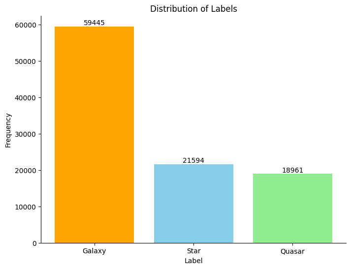
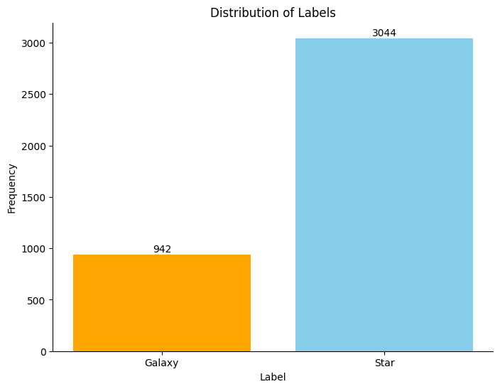
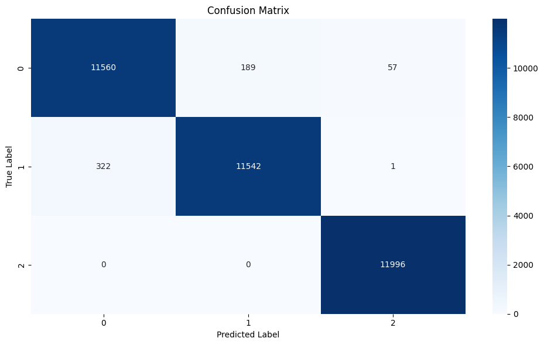
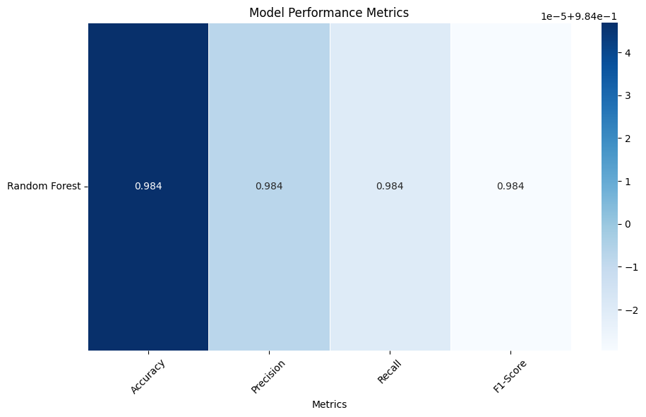
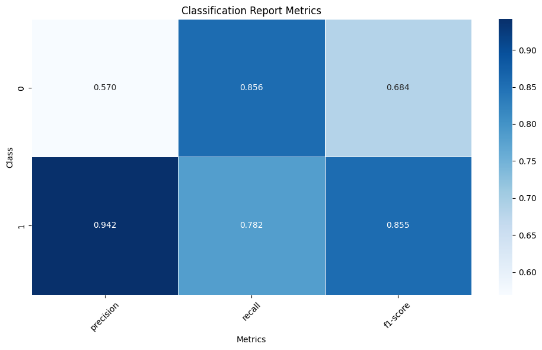
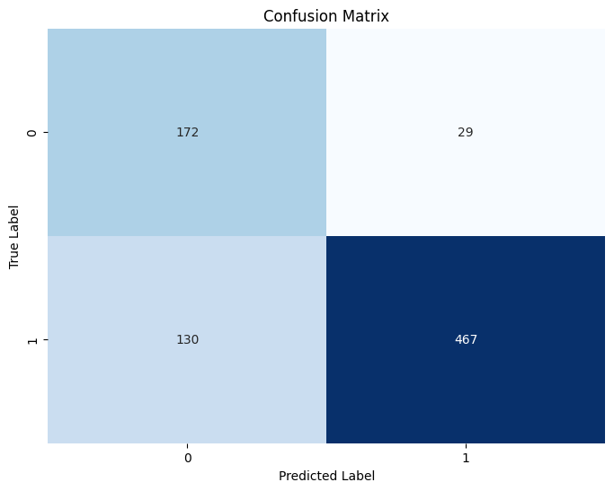

# Summary (ENG)

## Purpose
This document is my final thesis during my education at EC Utbildning (2022-2024). This thesis compares two different classification methods that you can apply on classification problems.
- Scikit-Learn - **Various machine learning algorithms**
- Tensorflow - **Convolutional Neural Network (CNN)**

These different models and algorithms will be tested on astronomical data. 

## Goal
In this thesis i set two main goals that should be answered - 

**1. How does the performance differ from each other between the more traditional machine learning algorithms from Scikit-Learn and convolutional neural networks (CNN) in the context of astronomy?**

**2. Is it possible to obtain an accuracy of at least 90% with both methods?**

## Method
The use of two different datasets was employed to complete this thesis. One dataset had numeric characteristics that explain different astronomical phenomena such as galaxies, stars and quasars. Whereas the other dataset only contained images of galaxies and stars. These datasets where used with the appropriate model and/or algorithm to get the most out of them.

    

        
         
        <em>Figure 1: Class distribution of numeric data</em>
    

    

        
         
        <em>Figure 2: Class distribution of image data</em>
    

## Results
Accuracy of both models -
<table>
    <tr>
        <th colspan="2">Accuracy of Final Models</th>
    </tr>
    <tr>
        <td>Model</td>
        <td>Accuracy</td>
    </tr>
    <tr>
        <td>Random Forest</td>
        <td>98,4%</td>
    </tr>
    <tr>
        <td>Convolutional Neural Network</td>
        <td>80,0%</td>
    </tr>
</table>

### Random Forest
The Random Forest model achieved a accuracy, precision, recall and F1-score of **98.4%** which both serves as proof that this algroithm was a good fit for this problem and also answers half of my initial goal **"Is it possible to obtain an accuracy of at least 90% with both methods?"** where it performed 8.4% better than the goal set in the beginning.

    

        
         
        <em>Figure 3: Confusion matrix of the final Random Forest model</em>
    

    

        
         
        <em>Figure 4: Performance metrics of the final Random Forest model</em>
    

### Convolutional Neural Network (CNN)
The final CNN model performed better than expected considering the insufficient data, more on that later. The accuracy of the CNN model was only 80,0% which does not live up to the initial goal of achieving a 90% accuracy. You can see that the model had particular problem with class label **0** which in this case was the minority class. 

    

        
         
        <em>Figure 5: Performance metrics of the final CNN model</em>
    

    

        
         
        <em>Figure 6: Confusion matrix of the final CNN model</em>
    

## Problems / Discussion

**Problem 1**
- Two different datasets was used to compare the different methods which could lead to unreliable and biased results.

**Problem 2**
- As you can see in figure 1 and 2, the datasets are very unbalanced towards each other both in terms of class difference and also in the amount of data the two datasets have. The class inbalance was fixed in the numeric dataset with the help of SMOTE, however i failed to balance the image dataset in the end. Which is why the results the CNN model (using image dataset) are fairly impressive.

**Problem 3**
- As you can also see in figure 1 and 2, the numeric dataset had an additional class, quasars. Which the image dataset did not have and could also lead to biased and unreliable results. Binary classification should in theory be easier than multiclass classification, either something is a star or it isn't a star i.e, galaxy. That advantage given to the CNN model did not really show, however as mentioned in **Problem 2** the classes were very inbalanced to begin with.

**Problem 4**
- The CNN models architecture was not tuned at all with Keras Tuner, while the Random Forest model was tuned with the help of cross-validation to try different hyperparameters to find the best combination. Keras Tuner would help in finding the best hyperparameters for the CNN model. 

## Future Work
- Testing the same datasets again but this time using Keras Tuner to tune the hyperparameters for the CNN model and see if better results can be achieved is most likely the first option.

- Secondly, finding a dataset that contain **both** images and numeric characteristics of different astronomical bodies would make the results much less unbiased towards one method.

- If finding or gathering a singular dataset is not on the table, then trying these two models again but with different datasets to see if they perform the same would also be a valid option to try.

## Datasets
The datasets used in this thesis are:
1. Dataset with images - [Divyansh Agrawal. (2021). Star-Galaxy Classification Data](https://www.kaggle.com/datasets/divyansh22/dummy-astronomy-data/data)
2. Numeric dataset - [fedesoriano. (January 2022). Stellar Classification Dataset - SDSS17](https://www.kaggle.com/datasets/fedesoriano/stellar-classification-dataset-sdss17)